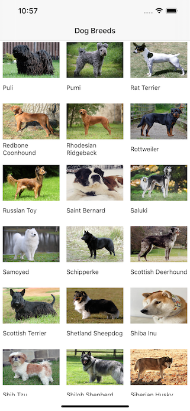
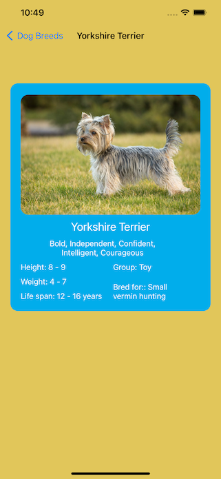

# Dog-Breeds

DogBreeds is a sample app that uses a very simple UICollectionView created programmatically. It displays all of the dog breeds in the collectionview. And pressing on one of the cells brings up a page with information about the breed. It uses information from api.thedogapi.com.

## License

DogBreeds is licensed under the Unlicense. See the LICENSE file for more information, but basically this is sample code and you can do whatever you want with it.
